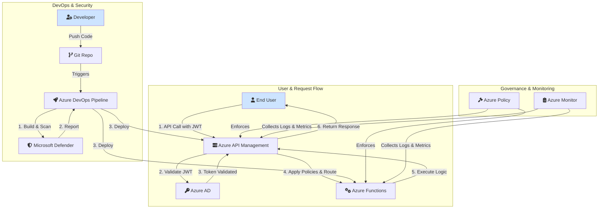

# Secure and Scalable Serverless APIs for Government Citizen Services on Azure

This project outlines the design and implementation of secure, scalable, and compliant serverless APIs hosted on Microsoft Azure. The solution leverages a suite of Azure-native tools to expose public services while ensuring robust security and governance.

## 1. Problem Statement

The citizen services portal requires a set of secure and scalable serverless APIs to expose public services to authenticated users. These APIs must be protected using OAuth 2.0 security via Azure Active Directory and include integrated security scanning within the CI/CD pipelines to ensure compliance and protect against vulnerabilities.

## 2. Solution Architecture

The proposed architecture uses a combination of Azure API Management, Azure Functions, and Azure Active Directory to create a secure and robust serverless API platform.

### High-Level Design



### Component Breakdown

-   **Azure API Management (APIM)**: Acts as the API gateway, providing a single entry point for all API requests. It handles request routing, security policy enforcement, and usage throttling.
-   **Azure Functions**: A serverless compute service that runs the backend business logic for the APIs.
-   **Azure Active Directory (Azure AD)**: Provides identity and access management. It is used to authenticate users and issue OAuth 2.0 JWT tokens.
-   **Azure DevOps**: Used to create CI/CD pipelines for automated building, testing, and deployment of the APIs and infrastructure.
-   **Microsoft Defender for Cloud**: Integrated into the CI/CD pipeline to perform vulnerability scanning on infrastructure and application code.
-   **Azure Policy**: Enforces governance rules across all Azure resources to ensure compliance and consistent configuration.

## 3. Implementation Steps

### Step 1: Design API Gateway with REST Endpoints
-   **Expose REST Endpoints**: Use Azure APIM to define and expose all public-facing REST endpoints.
-   **Route to Azure Functions**: Configure APIM to route incoming requests to the appropriate Azure Function that contains the business logic.
-   **Documentation**: Ensure all endpoints are well-documented and follow RESTful design standards.

### Step 2: Implement OAuth 2.0 Security
-   **Token Issuance**: Configure Azure AD to act as the OAuth 2.0 authorization server to issue JWTs for authenticated users.
-   **Token Validation**: Set up a policy in APIM to validate the incoming JWT on every request. This policy checks the token's signature, issuer, and expiration.
-   **Error Handling**: Implement secure error handling for failed token validations.

### Step 3: Enable Usage Plans and Throttling
-   **Rate Limiting**: Apply rate-limiting and throttling policies in APIM to prevent abuse and ensure fair usage.
-   **Header Transformation**: Use policies to transform request/response headers for compatibility with legacy backend systems if needed.

### Step 4: Integrate Vulnerability Scanning
-   **CI/CD Pipeline**: Create an Azure DevOps pipeline to automate the deployment of Azure Functions and APIM configurations.
-   **Security Scanning**: Integrate Microsoft Defender for Cloud into the pipeline to:
    1.  Scan infrastructure-as-code (IaC) templates and application code for vulnerabilities.
    2.  Provide a security score and actionable recommendations.

### Step 5: Enforce Governance and Compliance
-   **Apply Azure Policies**: Implement Azure Policies to enforce key governance rules:
    -   **Resource Tagging**: Enforce mandatory tagging for all resources for cost and ownership tracking.
    -   **Encryption at Rest**: Ensure that all storage accounts and databases have encryption at rest enabled.

## 4. Expected Output

## 5. Step-by-Step Implementation Guide

This guide will walk you through deploying the serverless API using the code in this repository.

### Prerequisites

1.  **Azure Account**: You need an active Azure subscription.
2.  **Azure DevOps Organization**: A free Azure DevOps organization linked to your Azure AD.
3.  **GitHub Repository**: The code pushed to your GitHub repository (which you have already done).

--- 

### Step 1: Create Azure Resources

First, we need to create the necessary resources in the Azure Portal.

1.  **Create a Resource Group**:
    *   In the [Azure Portal](https://portal.azure.com), search for `Resource groups` and click **Create**.
    *   Give it a name (e.g., `CitizenServices-RG`) and choose a region. Click **Review + create**.

2.  **Create a Function App**:
    *   Search for `Function App` and click **Create**.
    *   **Subscription**: Your Azure subscription.
    *   **Resource Group**: Select the one you just created (`CitizenServices-RG`).
    *   **Function App name**: Choose a globally unique name (e.g., `citizenservices-api-func`). **Remember this name!**
    *   **Publish**: Code.
    *   **Runtime stack**: `.NET`.
    *   **Version**: `6`.
    *   **Region**: The same region as your resource group.
    *   Click **Review + create** and then **Create**.

--- 

### Step 2: Set Up Azure DevOps

Now, let's set up an Azure DevOps project to build and deploy your code.

1.  **Create a New Project**:
    *   Go to your Azure DevOps organization (`dev.azure.com/{your_org}`).
    *   Create a **New project** and give it a name.

2.  **Create a Service Connection**:
    *   Inside your new project, go to **Project settings** (bottom-left corner) > **Service connections**.
    *   Click **New service connection**, select **Azure Resource Manager**, and choose **Service principal (automatic)**.
    *   Follow the prompts to authorize it for your Azure subscription. Give the connection a name (e.g., `Azure-Subscription-Connection`). **Remember this name!**

3.  **Create the Pipeline**:
    *   Go to **Pipelines** in the left menu and click **Create Pipeline**.
    *   Select **GitHub** as the location of your code.
    *   Select your repository.
    *   On the **Configure** step, choose **Existing Azure Pipelines YAML file**.
    *   Select the `azure-serverless-api/azure-pipelines.yml` file from the dropdown.
    *   **DO NOT RUN IT YET.** Click the dropdown arrow next to **Run** and select **Save**.

--- 

### Step 3: Configure and Run the Pipeline

1.  **Update Pipeline Variables**:
    *   In your local code editor, open the `azure-serverless-api/azure-pipelines.yml` file.
    *   Update the following variables with the names you chose in the previous steps:
        ```yaml
        variables:
          # ...
          functionAppName: 'citizenservices-api-func' # The name of the Function App you created
          azureSubscription: 'Azure-Subscription-Connection' # The name of your Service Connection
          # ...
        ```

2.  **Commit and Push the Changes**:
    *   Save the file, then commit and push it to your `main` branch on GitHub.
    ```bash
    git add azure-serverless-api/azure-pipelines.yml
    git commit -m "Configure pipeline variables"
    git push origin main
    ```

3.  **Monitor the Pipeline**:
    *   Pushing the change will automatically trigger the pipeline in Azure DevOps.
    *   Go to the **Pipelines** section in Azure DevOps, click on your pipeline, and watch the run. It will first run the **Build** stage and then the **Deploy** stage. Wait for it to complete successfully.

--- 

### Step 4: Test Your Deployed API

1.  **Get the Function URL**:
    *   In the [Azure Portal](https://portal.azure.com), navigate to the Function App you created.
    *   In the left menu, click on **Functions**, and you should see `GetCitizenData`.
    *   Click on `GetCitizenData`, then click **Get Function Url**.
    *   Copy the URL. It will look something like this: `https://citizenservices-api-func.azurewebsites.net/api/GetCitizenData?code=...`

2.  **Test in Browser or Postman**:
    *   Paste the URL into your web browser and press Enter.
    *   You should see the message: `Response from GetCitizenData function.`

Congratulations! You have successfully deployed and tested your secure serverless API.

-   **Secure APIs**: A set of secure and scalable APIs protected with OAuth 2.0 authentication.
-   **Robust CI/CD**: A fully automated CI/CD pipeline with integrated security scanning.
-   **Governance & Documentation**: Enforced governance policies and detailed, up-to-date API documentation.
