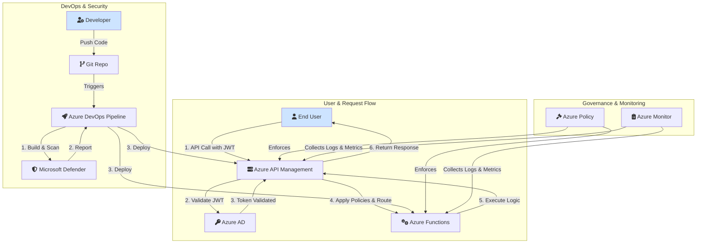

# Secure and Scalable Serverless APIs for Government Citizen Services on Azure

This project outlines the design and implementation of secure, scalable, and compliant serverless APIs hosted on Microsoft Azure. The solution leverages a suite of Azure-native tools to expose public services while ensuring robust security and governance.

## 1. Problem Statement

The citizen services portal requires a set of secure and scalable serverless APIs to expose public services to authenticated users. These APIs must be protected using OAuth 2.0 security via Azure Active Directory and include integrated security scanning within the CI/CD pipelines to ensure compliance and protect against vulnerabilities.

## 2. Solution Architecture

The proposed architecture uses a combination of Azure API Management, Azure Functions, and Azure Active Directory to create a secure and robust serverless API platform.

### High-Level Design



### Component Breakdown

-   **Azure API Management (APIM)**: Acts as the API gateway, providing a single entry point for all API requests. It handles request routing, security policy enforcement, and usage throttling.
-   **Azure Functions**: A serverless compute service that runs the backend business logic for the APIs.
-   **Azure Active Directory (Azure AD)**: Provides identity and access management. It is used to authenticate users and issue OAuth 2.0 JWT tokens.
-   **Azure DevOps**: Used to create CI/CD pipelines for automated building, testing, and deployment of the APIs and infrastructure.
-   **Microsoft Defender for Cloud**: Integrated into the CI/CD pipeline to perform vulnerability scanning on infrastructure and application code.
-   **Azure Policy**: Enforces governance rules across all Azure resources to ensure compliance and consistent configuration.

## 3. Implementation Steps

### Step 1: Design API Gateway with REST Endpoints
-   **Expose REST Endpoints**: Use Azure APIM to define and expose all public-facing REST endpoints.
-   **Route to Azure Functions**: Configure APIM to route incoming requests to the appropriate Azure Function that contains the business logic.
-   **Documentation**: Ensure all endpoints are well-documented and follow RESTful design standards.

### Step 2: Implement OAuth 2.0 Security
-   **Token Issuance**: Configure Azure AD to act as the OAuth 2.0 authorization server to issue JWTs for authenticated users.
-   **Token Validation**: Set up a policy in APIM to validate the incoming JWT on every request. This policy checks the token's signature, issuer, and expiration.
-   **Error Handling**: Implement secure error handling for failed token validations.

### Step 3: Enable Usage Plans and Throttling
-   **Rate Limiting**: Apply rate-limiting and throttling policies in APIM to prevent abuse and ensure fair usage.
-   **Header Transformation**: Use policies to transform request/response headers for compatibility with legacy backend systems if needed.

### Step 4: Integrate Vulnerability Scanning
-   **CI/CD Pipeline**: Create an Azure DevOps pipeline to automate the deployment of Azure Functions and APIM configurations.
-   **Security Scanning**: Integrate Microsoft Defender for Cloud into the pipeline to:
    1.  Scan infrastructure-as-code (IaC) templates and application code for vulnerabilities.
    2.  Provide a security score and actionable recommendations.

### Step 5: Enforce Governance and Compliance
-   **Apply Azure Policies**: Implement Azure Policies to enforce key governance rules:
    -   **Resource Tagging**: Enforce mandatory tagging for all resources for cost and ownership tracking.
    -   **Encryption at Rest**: Ensure that all storage accounts and databases have encryption at rest enabled.

## 4. Expected Output

## 5. Automated Backend Deployment with Terraform (Recommended)

This is the recommended method for deploying the backend infrastructure. It uses Terraform to create all required Azure resources automatically, avoiding manual errors and policy issues.

### Prerequisites

1.  **Install Terraform**: Follow the official guide at [https://learn.hashicorp.com/tutorials/terraform/install-cli](https://learn.hashicorp.com/tutorials/terraform/install-cli).
2.  **Install Azure CLI and Log In**: You need the Azure CLI installed. Log in by running `az login` in your terminal.

### Step-by-Step Guide

All commands should be run from the `terraform-backend` directory.

**1. Navigate to the Terraform Directory**
```bash
cd terraform-backend
```

**2. Initialize Terraform**
This command downloads the necessary Azure provider plugins.
```bash
terraform init
```

**3. Plan the Deployment**
This command shows you what resources Terraform will create. It's a dry run to verify everything is correct.
```bash
terraform plan
```

**4. Apply the Deployment**
This is the command that actually creates the resources in Azure. It will ask for your confirmation before proceeding.
```bash
terraform apply
```

When it asks for confirmation, type `yes` and press Enter. Terraform will now build your Resource Group, Storage Account, App Service Plan, and Function App with the correct settings.

After this is complete, you can proceed directly to **Section 6.2: Create the Pipeline** to set up the CI/CD for your newly created Function App.

---

## 6. Manual Guide Part A: Deploying the Backend API

This guide provides a detailed walkthrough for deploying the serverless backend API to Azure.

### Prerequisites
- An active Azure subscription.
- An Azure DevOps organization.

--- 

### Step 1: Create Core Azure Resources

**1.1. Navigate to the Azure Portal**
- Open your web browser and go to [https://portal.azure.com](https://portal.azure.com).
- Log in with your Azure account credentials.

**1.2. Create a Resource Group**
- A Resource Group is a container that holds related resources for an Azure solution.
- In the main search bar at the top of the portal, type `Resource groups` and select it from the services list.
- On the **Resource groups** page, click the **+ Create** button.
- **Subscription**: Select your Azure subscription.
- **Resource group**: Type a unique name, for example, `CitizenServices-RG`.
- **Region**: Choose a location close to you, for example, `(US) East US`.
- Click **Review + create**, and after validation passes, click **Create**.

**1.3. Create the Function App**
- This is the serverless resource that will host and run our backend API code.
- In the main search bar, type `Function App` and select it.
- On the **Function App** page, click **+ Create**.
- In the **Basics** tab:
    - **Subscription**: Ensure your subscription is selected.
    - **Resource Group**: Select the `CitizenServices-RG` group you just created.
    - **Function App name**: Enter a globally unique name, for example, `citizenservices-api-aamani`. **You must remember this name.**
    - **Publish**: Select `Code`.
    - **Runtime stack**: Select `.NET`.
    - **Version**: Select `6`.
    - **Region**: Select the same region you used for the resource group.
- Click **Review + create**, and then **Create**. Wait for the deployment to complete.

--- 

### Step 2: Set Up Azure DevOps for CI/CD

**2.1. Create a New DevOps Project**
- Navigate to your Azure DevOps organization: [https://dev.azure.com/{your_organization_name}](https://dev.azure.com/{your_organization_name})
- Click the **+ New project** button.
- **Project name**: Give it a name, like `CitizenServicesPortal`.
- **Visibility**: Keep it `Private`.
- Click **Create**.

**2.2. Create the Pipeline**
- This pipeline will automatically build and deploy your code from GitHub to your Function App.
- In your new project, navigate to **Pipelines** on the left menu.
- Click **Create Pipeline**.
- On the **"Where is your code?"** screen, select **GitHub**.
- You may need to authorize Azure Pipelines to access your GitHub account. Select your repository containing this project.
- On the **"Configure your pipeline"** screen, select **Existing Azure Pipelines YAML file**.
- In the **Path** dropdown, select the file: `/azure-serverless-api/azure-pipelines.yml`.
- Click **Continue**.
- You will see a review of the YAML file. **DO NOT RUN IT YET.** Click the dropdown arrow next to the **Run** button and select **Save**.

**2.3. Create a Service Connection**
- This creates a secure connection between Azure DevOps and your Azure subscription.
- In the bottom-left corner of your DevOps project, click **Project settings**.
- Under the **Pipelines** section, click **Service connections**.
- Click **Create service connection**.
- Select **Azure Resource Manager**, then click **Next**.
- Select **Service principal (automatic)**, then click **Next**.
- **Subscription**: Select the Azure subscription where you created your resources.
- **Resource Group**: Select `CitizenServices-RG`.
- **Service connection name**: Give it a memorable name, like `Azure-Subscription-Connection`. **You must remember this name.**
- Check the box for **Grant access permission to all pipelines**.
- Click **Save**.

--- 

### Step 3: Configure and Run the Pipeline

**3.1. Update Pipeline Variables in Your Code**
- In your local code editor (like VS Code), open the file `azure-serverless-api/azure-pipelines.yml`.
- Find the `variables` section and replace the placeholder values:
    - `functionAppName`: Replace `'YourFunctionAppName'` with the unique name you gave your Function App (e.g., `'citizenservices-api-aamani'`).
    - `azureSubscription`: Replace `'YourAzureServiceConnection'` with the name you gave your Service Connection (e.g., `'Azure-Subscription-Connection'`).

**3.2. Commit and Push the Changes to GitHub**
- Save the changes to the file.
- Use Git to commit and push the updated file. This push will trigger your pipeline.
```bash
git add azure-serverless-api/azure-pipelines.yml
git commit -m "Configure pipeline variables for deployment"
git push
```

**3.3. Monitor the Pipeline Run**
- Go back to the **Pipelines** section in Azure DevOps.
- You will see your pipeline is now running. Click on it to watch the progress of the **Build** and **Deploy** stages. Wait for both to complete with a green checkmark.

--- 

### Step 4: Test the Deployed Backend API

**4.1. Get the Function URL**
- Go back to the [Azure Portal](https://portal.azure.com).
- In the search bar, find and navigate to your Function App (`citizenservices-api-aamani`).
- On the left menu of the Function App, click **Functions**.
- You will see a function named `GetCitizenData` in the list. Click on it.
- In the `GetCitizenData` function overview, click **Get Function Url** at the top.
- Click the **Copy** icon to copy the full URL to your clipboard.

**4.2. Test in a Browser**
- Open a new tab in your web browser.
- Paste the copied URL into the address bar and press Enter.
- You should see the text: `Response from GetCitizenData function.`

**Congratulations! You have successfully deployed the secure, scalable, serverless backend API.**

## 6. Detailed Guide Part B: Deploying the Frontend Portal to AKS

This guide details how to containerize the `citizen-portal-ui` application and deploy it to an Azure Kubernetes Service (AKS) cluster.

### Prerequisites

-   **Azure CLI**: You must have the Azure CLI installed and configured (`az login`).
-   **Docker Desktop**: You need Docker running locally to build and test the container image.
-   **kubectl**: The Kubernetes command-line tool. You can install it via Azure CLI: `az aks install-cli`

--- 

### Step 1: Create Azure Infrastructure for AKS

1.  **Create an Azure Container Registry (ACR)**:
    *   ACR is a private Docker registry to store your container images.
    *   **Remember your ACR name!**
    ```bash
    # Use the existing Resource Group
    az acr create --resource-group CitizenServices-RG --name <YourUniqueACRName> --sku Basic --admin-enabled true
    ```

2.  **Create an Azure Kubernetes Service (AKS) Cluster**:
    *   This command creates a new AKS cluster and grants it permission to pull images from the ACR you just created.
    ```bash
    # Get the ID of your ACR
    ACR_ID=$(az acr show --name <YourUniqueACRName> --resource-group CitizenServices-RG --query "id" --output tsv)

    # Create the AKS cluster
    az aks create \
        --resource-group CitizenServices-RG \
        --name CitizenServicesCluster \
        --node-count 1 \
        --generate-ssh-keys \
        --attach-acr $ACR_ID
    ```

--- 

### Step 2: Build and Push the Docker Image

1.  **Log in to Your ACR**:
    ```bash
    az acr login --name <YourUniqueACRName>
    ```

2.  **Build the Docker Image**:
    *   Navigate to the `citizen-portal-ui` directory.
    *   The `.` at the end of the command is important.
    ```bash
    cd citizen-portal-ui
    docker build -t <YourUniqueACRName>.azurecr.io/citizen-portal:latest .
    ```

3.  **Push the Image to ACR**:
    ```bash
    docker push <YourUniqueACRName>.azurecr.io/citizen-portal:latest
    ```

--- 

### Step 3: Deploy to AKS

1.  **Connect to Your AKS Cluster**:
    *   This command configures `kubectl` to connect to your AKS cluster.
    ```bash
    az aks get-credentials --resource-group CitizenServices-RG --name CitizenServicesCluster
    ```

2.  **Update the Deployment Manifest**:
    *   Open the `citizen-portal-ui/k8s/deployment.yaml` file.
    *   Replace the `image` placeholder with the full name of the image you pushed to ACR:
    ```yaml
    # ...
    spec:
      containers:
      - name: citizen-portal
        image: <YourUniqueACRName>.azurecr.io/citizen-portal:latest # <-- Make sure this is correct!
    # ...
    ```

3.  **Apply the Kubernetes Manifests**:
    *   This command tells Kubernetes to create the resources defined in your YAML files.
    ```bash
    kubectl apply -f k8s/deployment.yaml
    kubectl apply -f k8s/service.yaml
    ```

--- 

### Step 4: Verify and Monitor the Deployment

1.  **Check the Deployment Status**:
    ```bash
    # See if the pods are running
    kubectl get pods
    ```

2.  **Get the Public IP Address**:
    *   It might take a few minutes for the external IP to be assigned.
    *   Run the command until you see an IP address under `EXTERNAL-IP`.
    ```bash
    kubectl get service citizen-portal-service --watch
    ```

3.  **Access the Portal**:
    *   Open a web browser and navigate to the `EXTERNAL-IP` address. You should see your Citizens Portal.

4.  **Monitor with Azure Monitor**:
    *   In the Azure Portal, navigate to your AKS cluster (`CitizenServicesCluster`).
    *   In the left menu, under **Monitoring**, click on **Insights**.
    *   Here you can view container logs, resource utilization (CPU/Memory), and the health of your nodes and pods.

-   **Secure APIs**: A set of secure and scalable APIs protected with OAuth 2.0 authentication.
-   **Robust CI/CD**: A fully automated CI/CD pipeline with integrated security scanning.
-   **Governance & Documentation**: Enforced governance policies and detailed, up-to-date API documentation.
